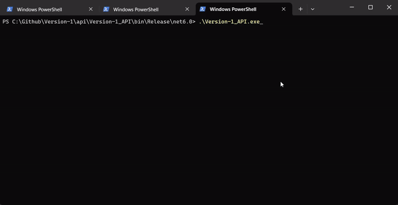

# Version-1 Malware
An experimental, in-development, malicious software with RCE, and Media writing capabilities as a core.

## Applications
1. **`api`** - Awaits connections from the C2 Client and the Payload, managing remote command execution by receiving commands from C2 Client and passing on to Payload, and receiving command results from Payload and passing them onto C2 Client. Also receives and saves exfiltrated data.
2. **`client`** - Means of connecting to the API to view online Payload instances and issue commands to each individually.
3. **`payload`** - Executes MediaWriter and CmdInterpreter modules on compromised machines.

## Modules
1. **`MediaWriter`** - Writes the payload to volumes other than the current working volume, this includes volumes of external storage media (ex. USB Drives)
3. **`CmdInterpreter`** - Remote Command Execution, for shell and payload specific commands.

## Languages used
- C# (For the API)
- Java (For the mail sender and the payload)
- Python (For Command and Control client)

## Setup Instructions (for Testing)
1. API - The api currently binds to localhost, so if one would expose the API to other machines on the internal network one will need to setup the `nginx` proxy to redirect to the localhost port the API is listening on. All in all run the version 1 API exe to run the API.
2. Payload - Build the JAR and run with java. It will attempt to connect to http://localhost:5000
3. C2 Client - Run the `main_gui.py` script. The c2 client will connect to a specified address upon login, ex. http://localhost:5000/api. The account admin:admin can be used for testing.
